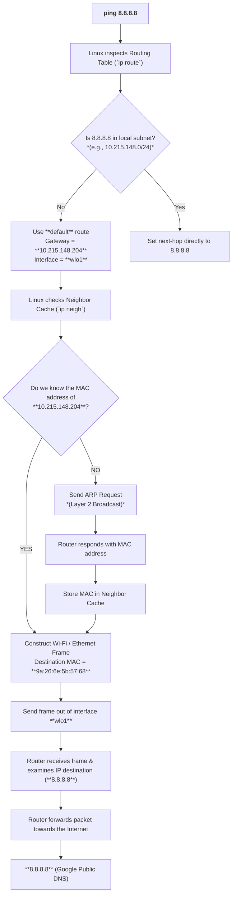

# Linux Networking: `ip route` vs `ip neigh`

A reference guide on how Linux determines where to route an IP packet (**Layer 3**) and how it resolves the physical MAC address (**Layer 2**) to deliver frames over a local network link.

---

## 💡 Core Concept

| Command | OSI Layer | Role | Primary Question Answered |
| :--- | :--- | :--- | :--- |
| `ip route` | **Layer 3** (Network) | Routing Decisions | *"Where should I send this IP packet?"* |
| `ip neigh` | **Layer 2** (Data Link) | Address Resolution (ARP/NDP) | *"What MAC address do I use on the local link to reach that next hop?"* |

* **`ip route`** decides **WHERE** the packet goes next (determines the next-hop IP and outgoing interface).
* **`ip neigh`** determines **HOW** to physically transmit the frame to that next hop (looks up or resolves the destination MAC address).

---

## 🔄 Packet Flow Architecture

When you execute a command like `ping 8.8.8.8`:



---

## 🔍 Detailed Example Breakdown

### Step 1: Routing Decision (`ip route`)
Linux checks its Layer 3 routing table to figure out the path to `8.8.8.8`.

```bash
$ ip route
default via 10.215.148.204 dev wlo1 proto dhcp src 10.215.148.150 metric 600
10.215.148.0/24 dev wlo1 proto kernel scope link src 10.215.148.150 metric 600
```

1. Target destination `8.8.8.8` is **not** in the local subnet (`10.215.148.0/24`).
2. Linux falls back to the `default` route.
3. Next Hop IP: **`10.215.148.204`** via interface **`wlo1`**.

---

### Step 2: Neighbor Resolution (`ip neigh`)
Before the packet can leave the network interface, it must be encapsulated into a Layer 2 frame (Ethernet / Wi-Fi). Linux needs the physical MAC address associated with IP `10.215.148.204`.

```bash
$ ip neigh
10.215.148.204 dev wlo1 lladdr 9a:26:6e:5b:57:68 REACHABLE
```

* **Cache Hit:** If the entry exists (as above), Linux uses `9a:26:6e:5b:57:68` immediately.
* **Cache Miss:** If the entry does not exist or is `STALE`/`FAILED`, Linux broadcasts an **ARP Request** (`"Who has 10.215.148.204?"`), receives an ARP reply, saves the MAC address into the neighbor cache, and proceeds.

---

## 📊 Summary Mapping

```text
IP Destination (8.8.8.8)
       │
       ▼
   ip route
       │
       ▼
Next Hop IP (10.215.148.204)
       │
       ▼
   ip neigh
       │
       ▼
Destination MAC (9a:26:6e:5b:57:68)
       │
       ▼
Wi-Fi / Ethernet Frame Sent Out
```

---

## 🛠️ Handy Commands

| Action | Command |
| :--- | :--- |
| View routing table | `ip route show` or `ip r` |
| View neighbor / ARP cache | `ip neigh show` or `ip n` |
| Flush ARP/Neighbor cache | `sudo ip neigh flush all` |
| Trace route taken by IP | `ip route get 8.8.8.8` |